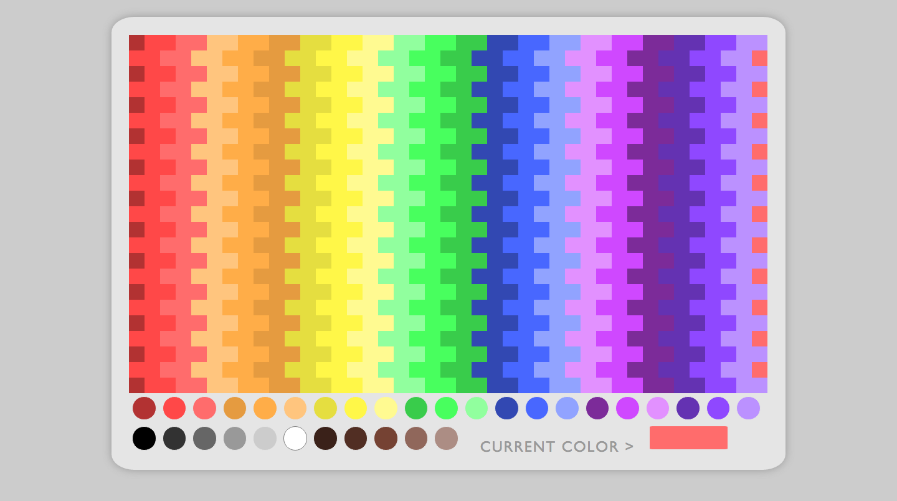

# pixel-art-maker

This simple pixel art program allows the user to pick from a palette of 31 colors to fill the squares as they choose. Simply click one of the palette circles to decide the current color and click away at each individual square. Inspired by Light Brites, Microsoft Paint, and coloring books, this project was a great exercise in JavaScript events and CSS styling.

